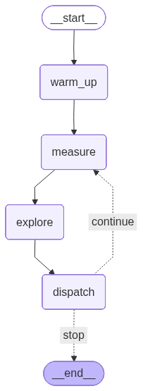

# 5. Multi-agent workflows

Chapters 1–4 drove a single agent — the `pov-gen` entrypoint reads, reasons, and
crafts PoVs on its own. Harder targets benefit from several agents working at
once. That needs *orchestration* — deciding who runs, on what, and when.

This template ships two ways to orchestrate. 
Both are alternate entrypoints, selected with `CRS_ENTRYPOINT` (see
[`entrypoint.sh`](../crs/entrypoint/entrypoint.sh)):

| Strategy | Entrypoint | Orchestrated by |
|----------|------------|-----------------|
| Claude Code subagents | `run_crs_subagents` | an LLM orchestrator agent (the Task tool) |
| LangGraph loop | `run_crs_langgraph` | a Python state machine |

The difference is *who holds the control flow*. With subagents, an LLM decides
the coordination at run time. With LangGraph, the macro loop is fixed in Python
and only the judgment-heavy steps are delegated to an LLM.

## 1. Claude Code subagents

A **subagent** is a Claude Code agent the main agent can delegate to. It is
defined by a markdown file in `.claude/agents/<name>.md` with YAML frontmatter
(`name`, `description`) and a body that is the subagent's system prompt. The
parent invokes one by name through the **Task tool**; the subagent runs in its
own context window, does its work, and returns a final report. Subagents inherit
the shared `CLAUDE.md` and skills from the working directory, so a definition
only needs to carry the agent's *role* — its workflow and its lane — not the
environment. The `description` is what the parent reads to decide when to
delegate, so it carries the routing logic. (See Claude Code's
[subagents](https://code.claude.com/docs/en/sub-agents) docs for the full
definition format.)

[`run_crs_subagents.py`](../crs/entrypoint/run_crs_subagents.py) runs one
`claude -p` **orchestrator** (system prompt:
[`crs/roles/orchestrator.md`](../crs/roles/orchestrator.md)) that delegates to a
three-agent team, installed into `.claude/agents/` from `crs/agents/`:

We designed the orchestrator prompt to launch the following subagents.
**Your task** is to create those subagents, and/or modify the orchestrator.
- `seed-gen` — owns the corpus and both fuzzers; generates seeds to grow coverage.
- `pov-gen` — crafts targeted PoVs from its own suspicions.
- `pov-gen-cov` — turns the code the fuzzer already covers into verified PoVs.

The orchestrator launches all three concurrently (it issues the Task calls in one
turn) and relaunches each as it returns, using `crs-coverage` to decide where to
push next. The coordination is the LLM's judgment — there is no fixed schedule.

## 2. Enhance the agent: write the subagent team

The orchestrator role is provided; the three subagent definitions are not provided —
**writing them is your task**. Each is a `crs/agents/<name>.md` (installed into
`.claude/agents/`), and carries only the agent's workflow instructions. 
`CLAUDE.md` already supplies the environment, tools, and rules.

```md
---
name: seed-gen
description: When the orchestrator should delegate to this agent.
---

The agent's workflow: what it does each pass, and what it must
never do (e.g. only seed-gen runs the fuzzer lifecycle; the pov agents only `add-seeds`).
```

Write `seed-gen`, `pov-gen`, and `pov-gen-cov`. Two things make the team work:

- **Mutually exclusive capabilities in each `description`.** The orchestrator routes on these, so they should not overlap.
- **One owner for shared state.** For example, who owns the lifecycle of launching the fuzzer? How about corpus management?

Run the strategy and confirm the orchestrator spawned the team:

```bash
CRS_ENTRYPOINT=run_crs_subagents uv run oss-crs run \
  --compose-file example/crs-bug-finding-template/compose.oauth.yaml \
  --fuzz-proj-path ../benchmarks/atlanta-libavc-full-01 \
  --target-harness mvc_dec_fuzzer

LOG_DIR=$(uv run oss-crs artifacts \
  --compose-file example/crs-bug-finding-template/compose.oauth.yaml \
  --fuzz-proj-path ../benchmarks/atlanta-libavc-full-01 \
  --target-harness mvc_dec_fuzzer --latest | jq -r '.crs."crs-bug-finding-template".log_dir')

grep -o 'seed-gen\|pov-gen-cov\|pov-gen' $LOG_DIR/agent/orchestrator_stream.jsonl | sort | uniq -c
```

You want to see all three subagents launched, and relaunched across the run.

## 3. The LangGraph loop

LangGraph models a workflow as a directed graph. A typed **state** (a `TypedDict`)
is threaded through it; a **node** is a Python function that takes the state and
returns a partial update; **edges** wire nodes in order, and a **conditional
edge** branches on the return of a router function. The graph compiles to a
runnable you `invoke`. A node can be pure Python (deterministic) or call an LLM
with `claude -p` — so you mix fixed control flow with delegated judgment.

[`run_crs_langgraph.py`](../crs/entrypoint/run_crs_langgraph.py) wires a
coverage-guided loop using the following nodes.

- `warm_up`, `measure` — **pure Python**: start the fuzzers, run `crs-coverage`.
- `explore` — a `claude -p` node ([`crs/roles/explorer.md`](../crs/roles/explorer.md))
  that emits a JSON list of bug candidates.
- `dispatch` — a `claude -p` node ([`crs/roles/dispatcher.md`](../crs/roles/dispatcher.md))
  that routes each candidate to the `pov-gen-cov` or `seed-gen` **subagent** and
  records a ledger — so the two strategies compose: a graph node that itself
  spawns subagents.
- `should_continue` — the **conditional edge**: loop back to `measure`, or stop
  on the round/budget limit.

Where the subagent strategy leaves the loop to the orchestrator's discretion,
here the loop is guaranteed by code: every round measures, then explores, then
dispatches, regardless of what the LLM decides.

The `draw_graph` entrypoint renders this exact topology (it reads the same
`build_graph` wiring) to a `.mmd` + `.png`:



## 4. Enhance the workflow: extend the graph

**Tasks start here**

The LangGraph implementation is kept intact — your task is to **add a node or
rewire the graph**. For example:

- a `triage` node between `explore` and `dispatch` that drops candidates already
  in the ledger or duplicates of each other, before spending agent turns on them;
- a different stop condition on the conditional edge (e.g. stop once N distinct
  PoVs exist).

All the hooks live in [`run_crs_langgraph.py`](../crs/entrypoint/run_crs_langgraph.py).
To add a node:

1. **Define the node** — a function `my_node(state: GraphState) -> dict` that
   returns a partial state update (pure Python, or a `claude -p` call like
   `explore`/`dispatch`).
2. **Register it** — add its name to the `NODE_NAMES` tuple and the `nodes` dict
   passed to `build_graph`.
3. **Wire it** — in `build_graph`, connect it with `add_edge` (unconditional) or
   `add_conditional_edges` (branching). To insert between two nodes, repoint the
   existing edge through yours.
4. **Extend the state** — if the node produces data a later node reads, add a
   field to the `GraphState` TypedDict and thread it through.

Then verify the wiring and run:

```bash
# 1. Render the topology and confirm your node is wired where you expect.
CRS_ENTRYPOINT=draw_graph uv run oss-crs run \
  --compose-file example/crs-bug-finding-template/compose.oauth.yaml \
  --fuzz-proj-path ../benchmarks/atlanta-libavc-full-01 \
  --target-harness mvc_dec_fuzzer

LOG_DIR=$(uv run oss-crs artifacts \
  --compose-file example/crs-bug-finding-template/compose.oauth.yaml \
  --fuzz-proj-path ../benchmarks/atlanta-libavc-full-01 \
  --target-harness mvc_dec_fuzzer --latest | jq -r '.crs."crs-bug-finding-template".log_dir')
open $LOG_DIR/run_crs_langgraph.png      # the rendered graph (also .mmd alongside)

# 2. Run the loop for real and watch the per-round node logs.
CRS_ENTRYPOINT=run_crs_langgraph uv run oss-crs run \
  --compose-file example/crs-bug-finding-template/compose.oauth.yaml \
  --fuzz-proj-path ../benchmarks/atlanta-libavc-full-01 \
  --target-harness mvc_dec_fuzzer

ls $LOG_DIR/agent/        # explore_*.jsonl, dispatch_*.jsonl, plus your node's log
```
